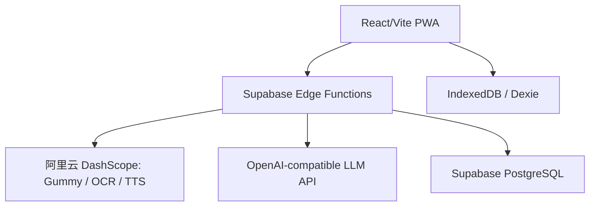

# System Patterns

## 总体架构

## 前端模式

- 单页应用由 `currentPage` 与 `displayMode` 驱动。
- `VoiceTranslateProvider` 包裹 `App`，保持录音逻辑不因页面切换而卸载。
- 共享类型集中在 `frontend/src/types/index.ts`。
- 服务调用集中在 `frontend/src/services/`，组件避免直连后端细节。
- 本地常用语、会话优先通过 Dexie/IndexedDB 管理。

## 后端模式

- Supabase Edge Functions 作为 API 边界，浏览器不直接访问 DashScope。
- `voice-translate` 支持两条输入路径：
  - `application/octet-stream` PCM 流，用于 Chrome/Edge 等支持 request body stream 的浏览器。
  - JSON base64 PCM，用于 Safari 等降级路径。
- 前端接收 NDJSON：`delta` 更新流式文案，`complete` 提供最终文本与 `audioUrl`。

## Agent Harness 模式

- 探索任务使用 ReAct：先读取 Memory Bank、README、CLAUDE 与目标模块，再决定改动。
- 实施任务使用 typed checklist：每个任务必须包含完成标准、验证命令、回滚边界。
- 高风险操作拆成 micro-tool 或人工确认边界：部署、数据库迁移、权限、密钥、删除数据。
- 工具/脚本输出应包含状态、摘要、下一步与产物，详见 [docs/agent-harness.md](../docs/agent-harness.md)。

